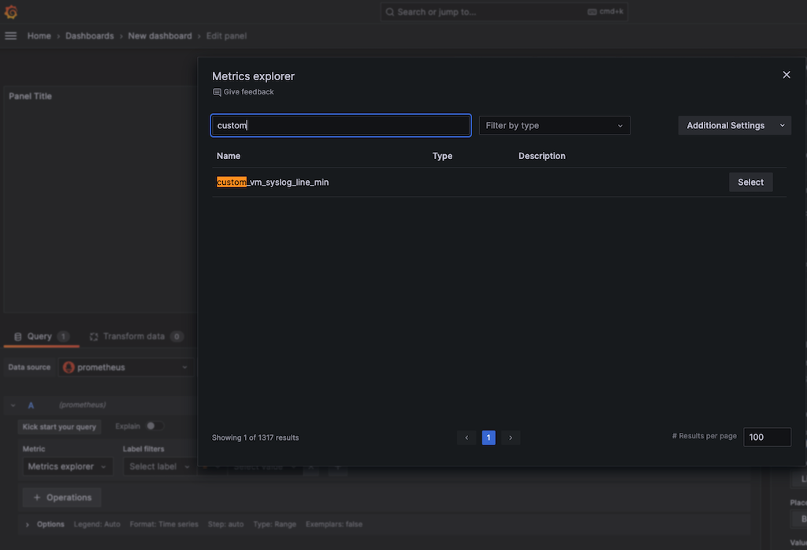
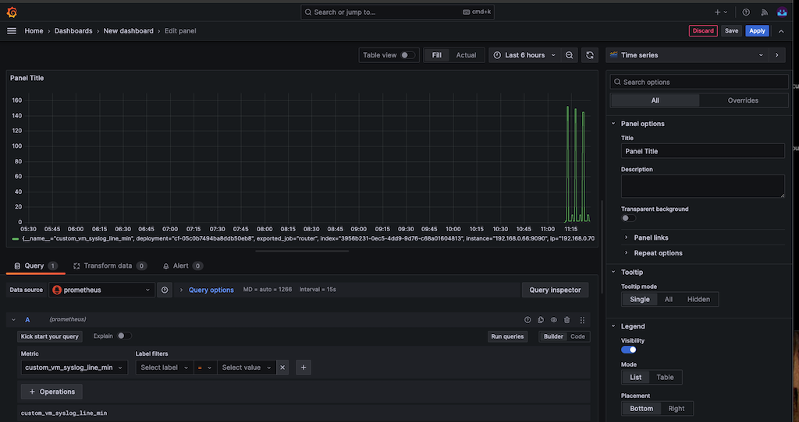

This document explains how to count `platform log volume per minute` as a `gauge` metric from bosh deployed vm, in particular for gorouter and display on grafana in healthwatch by leveraging [os-conf-release](https://github.com/cloudfoundry/os-conf-release) and [runtime-config](https://bosh.io/docs/runtime-config/). also it would be useful to understand how [bosh job lifecycle works](https://bosh.io/docs/job-lifecycle/)


## How to apply

### Create runtime-config
create a `osconf_custom_syslog_counter.yml` as following.

```
releases:
- name: os-conf
  version: 22.3.1                                        #<===== 1) should match the release version.

addons:
- name: os-configuration
  include:
    deployments:
    - cf-05c0b7494ba8ddb50eb8                             #<===== 2) replace with actual deployment name
    instance_groups:
    - router                                              #<===== 3) make sure the target instance groups(VM)

  jobs:
  - name: pre-start-script
    release: os-conf
    properties:
      script: |-
        #!/bin/bash
        ## <===== make sure no space above the /bin/bash

        JOB_CONFIG_PATH=/var/vcap/jobs/custom-syslog-counter/config
        LOG_PATH=/var/vcap/sys/log/custom-syslog-counter
        if [ -d $JOB_CONFIG_PATH ]; then
            rm -rf $JOB_CONFIG_PATH
        fi
        mkdir -p $JOB_CONFIG_PATH
        mkdir -p $LOG_PATH

        ## create a collector script.
        cat >  $JOB_CONFIG_PATH/custom_syslog_counter.sh <<EOF
        #!/bin/bash
        set -e
        JOB_CONFIG_PATH=/var/vcap/jobs/custom-syslog-counter/config
        ##                                               #<===== 4) customize filtering and counting logic below. 
        ##                                                          make sure to escape any $ sign
        ## SEARCH_BY_MIN=\$(date +"%Y-%m-%dT%H:%M")
        SEARCH_BY_MIN=\$(date +"%Y-%m-%dT%H:%M" --date "1 minute ago") #<===== to make sure all logs to be written to disk and then count. adjust the delayed time depending on system's load.
        line_count=\$(find /var/vcap/sys/log/gorouter -name "*.log" | xargs grep -a "\$SEARCH_BY_MIN" | wc -l) 
        # line_count=\$(find /var/vcap/sys/log/gorouter -name "*.log" | xargs grep -a "\$SEARCH_BY_MIN" | grep "vcap_request_id" | wc -l)

        echo "# HELP custom_vm_syslog_line_min counted under /var/vcap/sys/log" > \$JOB_CONFIG_PATH/metrics
        echo "# TYPE custom_vm_syslog_line_min gauge" >> \$JOB_CONFIG_PATH/metrics
        echo "custom_vm_syslog_line_min \$line_count" >> \$JOB_CONFIG_PATH/metrics
        echo "run by cron or manual: \$SEARCH_BY_MIN \$line_count"
        EOF
        
        chmod +x $JOB_CONFIG_PATH/custom_syslog_counter.sh
        ## test run
        $JOB_CONFIG_PATH/custom_syslog_counter.sh

        ## configure prom_scraper for custom-syslog-counter
        cat >  $JOB_CONFIG_PATH/prom_scraper_config.yml <<EOF
        ---
        port: 10000
        source_id: "custom_syslog_counter"
        instance_id: $(cat /var/vcap/instance/id)
        scheme: http
        server_name: $(cat /var/vcap/instance/name)
        EOF

        ## run server serving syslog count metric.
        cd $JOB_CONFIG_PATH
        set +e && killall python3 2>/dev/null
        set -e
        nohup python3 -m http.server --directory $JOB_CONFIG_PATH  10000 >> $LOG_PATH/custom_syslog_counter.log 2>&1 &

        ## to activate the custom metric
        chown -R root:vcap $JOB_CONFIG_PATH

        ## adding to system crontab
        #### run every 1 minute minimum by cron design
        CRON_JOB="* * * * * root $JOB_CONFIG_PATH/custom_syslog_counter.sh >> $LOG_PATH/custom_syslog_counter.log 2>&1"
        cat >  /etc/cron.d/custom_syslog_counter <<EOF
        $CRON_JOB
        EOF
        systemctl restart cron
        echo "Cron job added to /etc/cron.d/custom_syslog_counter. (this is not shown by crontab -l)"  >> $LOG_PATH/custom_syslog_counter.log
```

### create a runtime-config
```
bosh update-runtime-config --name=osconf_custom_syslog_counter ./osconf_custom_syslog_counter.yml
```

bosh configs
```
ubuntu@opsmanager-3-0:~/workspace$ bosh configs
Using environment '192.168.0.55' as client 'ops_manager'

ID   Type     Name                                      Team  Created At
52*  cloud    default                                   -     2025-08-14 08:23:42 UTC
29*  cpi      default                                   -     2025-07-04 00:44:01 UTC
49*  runtime  cf-05c0b7494ba8ddb50eb8-bosh-dns-aliases  -     2025-08-04 03:04:52 UTC
50*  runtime  cf-05c0b7494ba8ddb50eb8-otel-collector    -     2025-08-04 03:05:02 UTC
3*   runtime  director_runtime                          -     2025-04-15 07:05:13 UTC
1*   runtime  ops_manager_dns_runtime                   -     2025-04-15 07:05:13 UTC
2*   runtime  ops_manager_system_metrics_runtime        -     2025-04-15 07:05:13 UTC
59*  runtime  osconf_custom_syslog_counter              -     2025-08-28 07:08:10 UTC
```

### upload os-conf release to bosh-director

#### os-conf from tanzu opsmanager VM
```
bosh upload-release /var/tempest/internal_releases/os-conf

bosh releases | grep os-conf
os-conf                        	22.3.1             	b6900bc

```

#### os-conf from public repo
```
wget https://bosh.io/d/github.com/cloudfoundry/os-conf-release?v=22.3.1
```

```
bosh upload-release ./os-conf-release\?v\=22.3.1

bosh releases | grep os-conf
os-conf                        	22.3.1            	b6900bc

```
### apply change to deployment from opsmanager UI or bosh cli.

now bosh deploy should include the new runtime config into the deployment. 

```
bosh  -d cf-05c0b7494ba8ddb50eb8 manifest > cf.yml
bosh  -d cf-05c0b7494ba8ddb50eb8 deploy ./cf.yml
```

during the apply change, the `pre-start-script` job from the runtime config above will create `/var/vcap/jobs/pre-start-script/bin/pre-start` file in the target deployment and it run before the jobs are starting by [bosh job lifecycle design](https://bosh.io/docs/job-lifecycle/).
after `pre-start-script`, all job will be restarted including `prom_scraper`, so that it will be scraping the new metric.


### Changes from the target VM.

```
router/3956b231-0ec5-4dd9-9d76-c68a01604813:~# cat /var/vcap/jobs/custom-syslog-counter/config/custom_syslog_counter.sh
#!/bin/bash
set -e
JOB_CONFIG_PATH=/var/vcap/jobs/custom-syslog-counter/config
SEARCH_KEYWORD=$(date +"%Y-%m-%dT%H:%M" --date "1 minute ago")
line_count=$(find /var/vcap/sys/log/gorouter -name "*.log" | xargs grep -a "$SEARCH_KEYWORD" | wc -l)
echo "# HELP custom_vm_syslog_line_min counted under /var/vcap/sys/log" > $JOB_CONFIG_PATH/metrics
echo "# TYPE custom_vm_syslog_line_min counter" >> $JOB_CONFIG_PATH/metrics
echo "custom_vm_syslog_line_min $line_count" >> $JOB_CONFIG_PATH/metrics
echo "$SEARCH_KEYWORD $line_count"
```

note that system crontab configuration is not shown by crontab -l command (user crontab command)
```
router/3956b231-0ec5-4dd9-9d76-c68a01604813:~# cat  /etc/cron.d/custom_syslog_counter
* * * * * root /var/vcap/jobs/custom-syslog-counter/config/custom_syslog_counter.sh >> /var/vcap/sys/log/custom-syslog-counter/custom_syslog_counter.log 2>&1
```

```
router/3956b231-0ec5-4dd9-9d76-c68a01604813:~# cat /var/vcap/jobs/custom-syslog-counter/config/metrics
# HELP custom_vm_syslog_line_min counted under /var/vcap/sys/log
# TYPE custom_vm_syslog_line_min counter
custom_vm_syslog_line_min 145
```

```
router/3956b231-0ec5-4dd9-9d76-c68a01604813:~# ps -ef | grep http.server
root       31692       1  0 02:09 ?        00:00:00 python3 -m http.server --directory /var/vcap/jobs/custom-syslog-counter/config 10000
```

and http://127.0.0.1:10000/metrics should provide the exact the same contents from `/var/vcap/jobs/custom-syslog-counter/config/metrics`
```
curl http://127.0.0.1:10000/metrics
# HELP custom_vm_syslog_line_min counted under /var/vcap/sys/log
# TYPE custom_vm_syslog_line_min counter
custom_vm_syslog_line_min 145

```


```
router/3956b231-0ec5-4dd9-9d76-c68a01604813:~# cat /var/vcap/jobs/custom-syslog-counter/config/prom_scraper_config.yml
---
port: 10000
source_id: "custom_syslog_counter"
instance_id: b58a0b0e-5122-4ce2-b877-7ba8a2cda970
scheme: http
server_name: router
```

```
router/3956b231-0ec5-4dd9-9d76-c68a01604813:~# monit summary
The Monit daemon 5.2.5 uptime: 14m

Process 'gorouter'                  running
Process 'gorouter-healthchecker'    running
Process 'loggregator_agent'         running
Process 'loggr-syslog-agent'        running
Process 'loggr-forwarder-agent'     running
Process 'loggr-udp-forwarder'       running
Process 'prom_scraper'              running
Process 'bosh-dns'                  running
Process 'bosh-dns-resolvconf'       running
Process 'bosh-dns-healthcheck'      running
Process 'system-metrics-agent'      running
Process 'otel-collector'            running
System 'system_b58a0b0e-5122-4ce2-b877-7ba8a2cda970' running
```

and this should be discoverd by `prom_scraper` job which is indicated by the increased`scrape_targets_total` number

```
router/3956b231-0ec5-4dd9-9d76-c68a01604813:~# curl -k https://localhost:14821/metrics --cacert /var/vcap/jobs/prom_scraper/config/certs/scrape.crt --cert /var/vcap/jobs/prom_scraper/config/certs/scrape.crt --key /var/vcap/jobs/prom_scraper/config/certs/scrape.key

...

# HELP scrape_targets_total Total number of scrape targets identified from prom scraper config files.
# TYPE scrape_targets_total counter
scrape_targets_total 7                   #<===== it is increased from 6 to 7 in my lab.
```

#### check logs
 tail -f /var/vcap/sys/log/custom-syslog-counter/custom_syslog_counter.log
``` 
run by cron or manual: 2025-09-29T10:28 1        #<=====  measuring count by cron every 1 minute
127.0.0.1 - - [29/Sep/2025 10:30:04] "GET /metrics HTTP/1.1" 200 -  #<===== scraped by prometheus 
run by cron or manual: 2025-09-29T10:29 1
127.0.0.1 - - [29/Sep/2025 10:31:04] "GET /metrics HTTP/1.1" 200 -
```


## grafana dashboard
then, the metric `custom_vm_syslog_line_min` should be available from grafana dashboard.

it has following metadata:
```
{__name__="custom_vm_syslog_line_min", deployment="cf-05c0b7494ba8ddb50eb8", exported_job="router", index="1ebd2b5c-b269-44cb-a06f-9ebf8b82f939", instance="192.168.0.66:9090", ip="192.168.0.100", job="healthwatch-pas-exporter", product="VMware Tanzu Application Service", scrape_instance_group="pas-exporter-counter", source_id="custom_syslog_counter", system_domain="sys.lab.pcfdemo.net"}
```

if you want to summarize all metrics, use following promql:

```
sum(custom_vm_syslog_line_min)
```





## Calculate sum of all values during a specific period across of all instances
To calculate the sum of all values for gauge metric, `custom_vm_syslog_line_min`, `prometheus API` can be solution as described in the prometheus documentation.(https://prometheus.io/docs/prometheus/latest/querying/api/#range-queries)


Alternatively, grafana dashboard can be used to visualize the value. for example, following the procedure describes how to calculate total for `yesterday` metrics:
0. go to grafana dashboard, create a new graph go into graph edit mode.
1. new Dashboard
2. add a new panel 
3. type in promql as following
```promql
sum(sum_over_time(custom_vm_syslog_line_min[24h]))
```
- > calculates the sum of all values recorded for the metric over the `24-hour period`. 
- > The outer sum() is to aggregate across all instances
4. configure time range to yesterday by clicking time range dropdown list and double click yesterday from the calendar. it will set `from` and `to` field. and click `apply time range`
5. from `Time Series` graph configuration, go to `Legend` section:
- > check `Visibility`
- > click `Table` mode
- > from `Values` drop down list, select `Last`
the `last` value is the `total` of all values during the period. and it will be displayed on `legend` area as table with following configuration:


## VM resource consumption

```
router/1ebd2b5c-b269-44cb-a06f-9ebf8b82f939:/var/vcap/bosh_ssh/bosh_b85c34a5b56b41c# 

ps -eo %cpu,%mem,pid,pgid,tid,user,rss,cmd --sort %cpu | grep http.server
 0.3  0.8   13272   13190   13272 root     17372 python3 -m http.server --directory /var/vcap/jobs/custom-syslog-counter/config 10000
 0.0  0.1   13822   13821   13822 root      2236 grep --color=auto http.server
```
