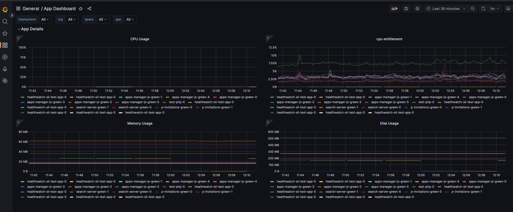

## Sample App Monitoring Dashboard for TAS Healthwatch2

this sample dashboard is tested on 
- Healthwatch for TAS 2.2.8 
- Healthwatch Exporter for TAS 2.2.8

## How to apply

import [healthwatch2_app_dashboard.json](healthwatch2_app_dashboard.json) file to healthwatch grafana UI.

1. goto browse > New > Import from Grafana UI.
2. copy and paste contents of [healthwatch2_app_dashboard.json](healthwatch2_app_dashboard.json) and load.
3. update Name and UID and Import

