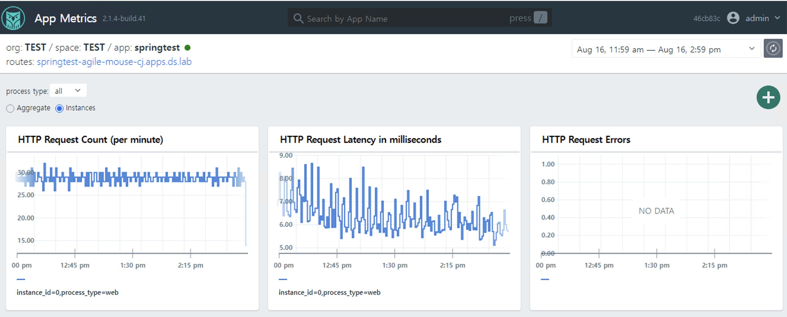

## Sample App Dashboard using Metric-store as a prometheus datasource in grafana

NOTE: this custom healthwatch dashboard is experimental and intended to show how to integrate metric-store with grafana.
the histogram chart doesn't reflect actual histogram chart yet and is required to set more tuning.




this sample dashboard is tested on 
- Healthwatch for TAS 2.2.8 
- Healthwatch Exporter for TAS 2.2.8

## How to apply

#### Configure metric-store as datasource in healthwatch2 grafana.


1. go to grafana> configuration> new datasource> prometheus. set other option as default.
- Name: ds-metric-store
- HTTP > prometheus server URL: https://metric-store.service.internal:8080
- Auth > TLS Client Auth : enable
- Auth > With CA Cert: enable
- TLS/SSL Auth Details> Server Name: metric-store # should match exactly with SAN in Client Cert
- TLS/SSL Auth Details> CA Cert: ## copy and paste from metric-store deployment> metric-store/0 VM: /var/vcap/jobs/metric-store/config/certs/metric_store_metrics_client_ca.crt 
- TLS/SSL Auth Details> Client Cert: ## copy and paste from metric-store deployment> metric-store/0 VM: /var/vcap/jobs/metric-store/config/certs/metric_store_metrics_client.crt
- TLS/SSL Auth Details> Client Key: ## metric-store/0: ## copy and paste from metric-store deployment> metric-store/0 VM: /var/vcap/jobs/metric-store/config/certs/metric_store_metrics_client.key

2. click "test & save" button

#### Import [healthwatch2_app_dashboard2_metricstore.json](healthwatch2_app_dashboard2_metricstore.json) file to healthwatch grafana UI.

1. goto browse > New > Import from Grafana UI.
2. copy and paste contents of [healthwatch2_app_dashboard2_metricstore.json](healthwatch2_app_dashboard2_metricstore.json) and load.
3. update Name and UID and Import
4. edit the panel(chart) and adjust the datasource created above.

#### Dashboard config

1. http_duration_seconds_bucket_histogran_95_percentile
- Query: sum(rate(http_duration_seconds_bucket{organization_name=~"$org", space_name=~"$space", app_name="$app"}[$__interval])) by (le)
- Chart: Heatmap


2. http_total per min
- Query: sum(increase(http_total{organization_name=~"$org", space_name=~"$space", app_name="$app"}[$__interval]))
- Chart: Time series

## Troubleshooting
#### fetch sample app data from  metric-store
https://docs.vmware.com/en/Metric-Store/1.6/metric-store/GUID-using.html

```
ubuntu@nh-opsmanager:~$ curl -H "Authorization: $TOKEN"  -G https://metric-store.SYS_DOMAIN/api/v1/query --data-urlencode "query=http_duration_seconds_bucket" -k 
```

#### see if the same output from metric-store VM directly.
ssh into metric-store deployment> metric-store/0 and go to /var/vcap/jobs/metric-store/config
```
metric-store/039975eb-1f8c-40a7-be5b-99b4af94219c:/var/vcap/jobs/metric-store/config# 
```
run command and fetch app metric.
```
curl -k --cert ./certs/metric_store.crt --key ./certs/metric_store.key --cacert ./certs/metric_store_ca.crt https://localhost:8080/api/v1/query --data-urlencode "query=http_duration_seconds_bucket" 
```

#### customizing chart in grafana
https://grafana.com/blog/2020/06/23/how-to-visualize-prometheus-histograms-in-grafana/
