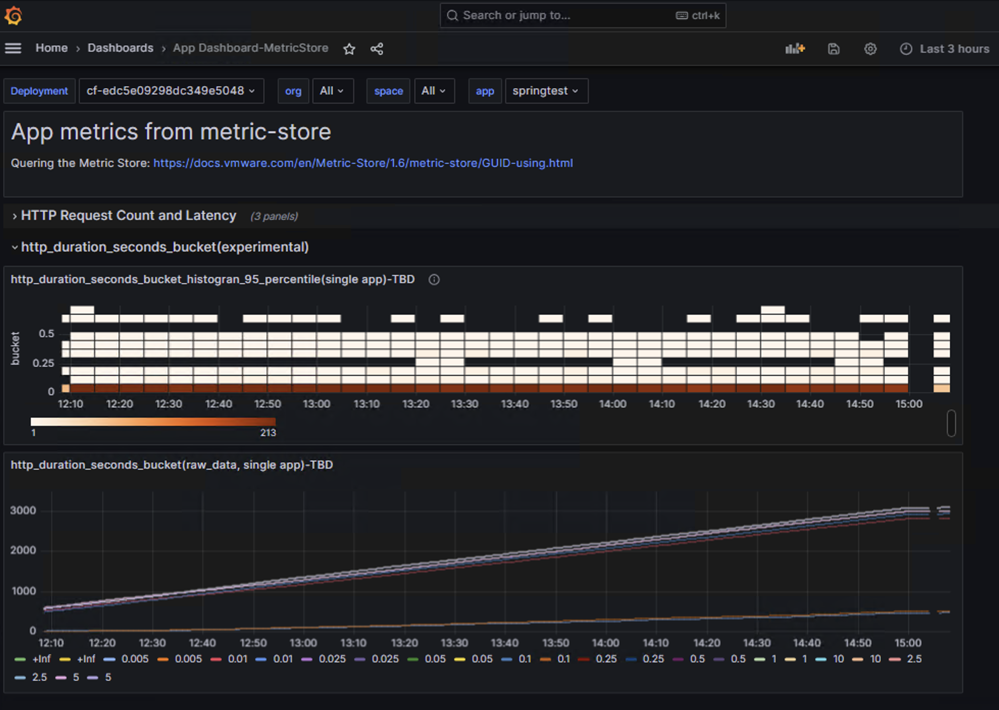

## Sample App Monitoring Dashboard using Metric-store as datasource

this sample dashboard is tested on 
- Healthwatch for TAS 2.2.8 
- Healthwatch Exporter for TAS 2.2.8

## How to apply

#### Configure metric-store as datasource in healthwatch2 grafana.

1. go to grafana> configuration> new datasource> prometheus. set other option as default.
- Name: ds-metric-store
- HTTP > prometheus server URL: https://metric-store.service.internal:8080
- Auth > TLS Client Auth : enable
- Auth > With CA Cert: enable
- TLS/SSL Auth Details> Server Name: metric-store # should match exactly with SAN in Client Cert
- TLS/SSL Auth Details> CA Cert: ## copy and paste from metric-store deployment> metric-store/0 VM: /var/vcap/jobs/metric-store/config/certs/metric_store_metrics_client_ca.crt 
- TLS/SSL Auth Details> Client Cert: ## copy and paste from metric-store deployment> metric-store/0 VM: /var/vcap/jobs/metric-store/config/certs/metric_store_metrics_client.crt
- TLS/SSL Auth Details> Client Key: ## metric-store/0: ## copy and paste from metric-store deployment> metric-store/0 VM: /var/vcap/jobs/metric-store/config/certs/metric_store_metrics_client.key

2. click "test & save" button

#### Import [healthwatch2_app_dashboard2_metricstore.json](healthwatch2_app_dashboard2_metricstore.json) file to healthwatch grafana UI.

1. goto browse > New > Import from Grafana UI.
2. copy and paste contents of [healthwatch2_app_dashboard2_metricstore.json](healthwatch2_app_dashboard2_metricstore.json) and load.
3. update Name and UID and Import
4. edit the panel(chart) and adjust the datasource created above.

